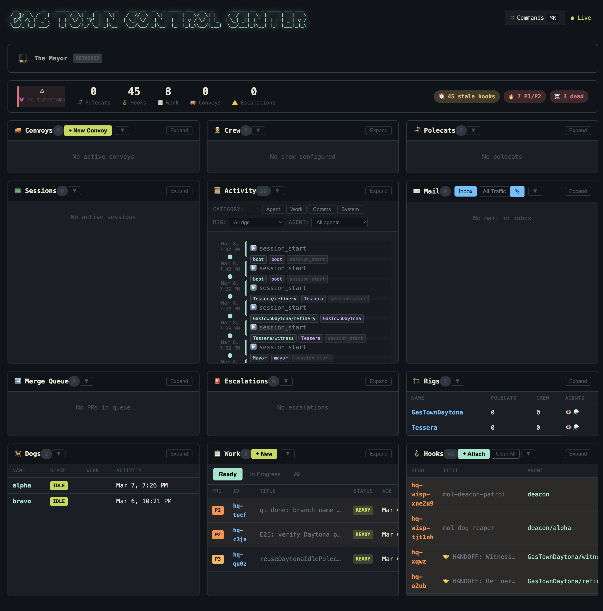

There's a moment in every serious AI coding setup where you realize you've hit a ceiling. Not a capability ceiling — the models are plenty capable. You've hit a *coordination* ceiling.

You're running Claude in one terminal, telling it to implement a feature. Halfway through, it needs context from a different part of the codebase. You context-switch manually. The session loses track of what it was doing. You restart, re-explain, and burn another ten minutes not writing code.

Then you think: *what if I just run more agents in parallel?*

And you try it. Four terminals, four Claude Code sessions, four tasks going at once. For about twenty minutes, it feels like the future. Then one agent finishes and you can't remember what you assigned it. Another needs input that a third agent already produced but you didn't route it. A session crashes and the work state is gone. Chaos.

That's the problem [GasTown](https://github.com/steveyegge/gastown) solves.

---

## What GasTown Actually Is

GasTown is a multi-agent workspace manager. It doesn't replace your agents — it gives them a persistent, coordinated environment to operate in. Think of it less like a framework and more like an operating system layer: it handles identity, mailboxes, work state persistence, and task routing so your agents don't have to.

It hit 11.3k stars on GitHub shortly after launch. That's not hype — that's practitioners recognizing a real gap getting filled.

The key insight behind it: agent sessions are ephemeral, but **work state doesn't have to be**. GasTown uses git worktrees as persistent storage (called "hooks") so when a session ends or crashes, the work isn't gone. The agent can resume exactly where it left off.

This is the difference between "I ran some AI agents" and "I have a reliable AI engineering team."

---

## The Cast of Characters

Before you run a single command, you need to understand who does what. The GasTown mental model maps cleanly to a construction site or a small engineering org — and once it clicks, the rest falls into place.

### The Mayor 🎩

The Mayor is your primary agent instance. It has full context about your workspace, knows all your projects, knows what agents are running, and can orchestrate work across all of them. This is where you start. Every time. You tell the Mayor what you want to build; the Mayor figures out how to distribute the work.

The Mayor does planning, coordination, and cross-context reasoning. It breaks down big objectives into concrete beads (tasks), creates convoys (work tracking units), and slings work to agents. It's the expensive, smart piece — and it should be on your strongest model.

### The Crew 👤

That's you. Crew members are human workspaces within a rig (a project container). You do hands-on work, review what agents produce, and make the architectural calls the Mayor can't make alone. The crew workspace is yours — your files, your terminal, your codebase access.

### Polecats 🦨

Polecats are worker agents. They have persistent identity but ephemeral sessions: spin one up for a task, it does the work, the session ends — but the identity and work history persist. You can sling a bead to a polecat, it implements the fix, and when it's done, that context survives for the next task.

Polecats are your workhorse agents. They're where the actual code gets written. Because they run frequently and their tasks are scoped (implement this feature, write this test, fix this bug), they don't need the strongest model — and you'll save significant API budget by running them on Sonnet rather than Opus.

### The Deacon ⛪

The Deacon is a patrol agent — it monitors the workspace, checks on running agents, handles ambient housekeeping tasks. Think of it as the background process that keeps the town functional. It runs in cycles, and because those cycles are lightweight, it can run on a smaller model (Haiku works well here).

---

## The Model Assignment Question

This is where people leave serious money on the table, and it's worth addressing directly.

Running Opus for everything is like hiring a principal engineer to write your boilerplate. It will be very good boilerplate. It is also completely unnecessary.

The pattern that works, [backed by community experience](https://github.com/steveyegge/gastown/discussions/1642):

- **Mayor + Crew**: Opus 4.6. Planning, coordination, cross-context reasoning. This is where coherence over long sessions matters most. Pay for it.
- **Polecats**: Sonnet 4.6. Fast, capable, scoped tasks. This is the right tool for implementation work. The cost savings compound when polecats are spun up frequently across many tasks.
- **Deacon / Witness**: Sonnet 4.6 or Haiku 4.5. Monitoring and patrol cycles are lightweight work. Haiku is often more than sufficient.

The practical heuristic from my own usage: **assign model cost proportional to reasoning depth required**. The Mayor needs to hold an entire project's architecture in context and make good decomposition decisions. A polecat needs to implement a scoped task correctly. These are very different cognitive loads, and treating them as equivalent is expensive.

To wire this up, first register named agent configs at the workspace level:

```bash
gt config agent set claude-sonnet "claude --model claude-sonnet-4-6 --dangerously-skip-permission"
gt config agent set claude-opus "claude --model claude-opus-4-6 --dangerously-skip-permission"
gt config agent set claude-haiku "claude --model claude-haiku-4-5 --dangerously-skip-permission"

# Start the Mayor on Opus
gt mayor start --agent claude-opus

# Sling a task to a Sonnet polecat explicitly
gt sling gt-abc12 myproject --agent claude-sonnet
```

The `--agent` flag works for one-off overrides, but the cleaner production setup is to bake assignments into each rig's `settings/config.json` so the right model is used automatically without thinking about it on every sling:

```json title='settings/config.json'
{
  "roles": {
    "mayor": {
      "agent": "claude-opus"
    },
    "polecat": {
      "agent": "claude-sonnet"
    },
    "deacon": {
      "agent": "claude-haiku"
    }
  }
}
```

Define it once per rig or in the town settings and your model routing is handled. Your API spend will reflect the actual cognitive load of each role rather than paying Opus rates across the board.

---

## Getting Started in 10 Minutes

You need: Go 1.23+, Git 2.25+, Claude Code CLI, and `beads` (the `bd` CLI — GasTown's underlying task tracker).

If you want the full experience with tmux (recommended — it lets the Mayor manage terminal panes), make sure `tmux 3.0+` is installed and it just works.

```bash
# Install GasTown
brew install gastown
# or: npm install -g @gastown/gt

# Create your workspace
gt install ~/gt --git
cd ~/gt

# Add your first project (point it at any git repo)
gt rig add myproject https://github.com/you/your-repo.git

# Create your crew workspace
gt crew add yourname --rig myproject
cd myproject/crew/yourname

# Attach to the Mayor — this is your main interface
gt mayor attach
```

That's it. You're in. Tell the Mayor what you want to build.


### The Core Workflow Loop

Once you're in the Mayor session, the workflow is deliberately simple:

**1. Describe the work.** Tell the Mayor what you want: "Implement user authentication with JWT, add tests, handle token refresh." The Mayor breaks this into beads.

**2. Create a convoy.** A convoy bundles related beads and tracks their collective progress. The Mayor typically creates these for you, but you can also do it manually:

```bash
gt convoy create "Auth System" gt-x7k2m gt-p9n4q --notify --human
```

**3. Sling work to agents.** `gt sling` assigns a bead to a polecat and spawns the agent:

```bash
gt sling gt-x7k2m myproject
```

**4. Monitor progress.**

```bash
gt feed             # A live feed of everything happening across the town
gt status           # High-level status of the town and its workers
gt convoy list      # Overview of all convoys
gt convoy show      # Details on the current one
gt agents           # What's running right now
```

**5. Review and iterate.** Polecats report back through the convoy and changes are merged by the refinery through **M**erge **R**equestst. You review the output, give feedback through the Mayor, and the loop continues.

---

## The Docker Path

If you'd rather not install Go tooling locally, or you want a clean isolated environment, GasTown works well in Docker. A basic `docker-compose.yml` to get a workspace running is included in the repository.

Run `docker-compose up -d`, then `docker-compose exec gastown bash` to drop into the environment. From there, the same setup steps apply.

This pattern is especially useful if you're running GasTown in a CI-like environment or want to keep agent execution isolated from your host machine.

---

## The Dashboard

Once you have more than a handful of agents running, the terminal view stops being enough. `gt dashboard --port 8080` starts a web UI that gives you a real-time overview of everything happening in your town: which agents are active, where each convoy stands, and the current state of every hook. It's the difference between flying blind and having an actual control panel. I leave it open in a browser tab whenever I'm running a serious multi-agent session — glancing at it costs nothing and catching a stuck agent early saves a lot of time.



---

## Hooks and Recovery with `gt prime`

The reason GasTown can make reliability guarantees that raw parallel agents can't is the hook system. Every polecat's work state is written into a git worktree — not held in memory, not in a tmux pane, not dependent on a session staying alive. When an agent crashes, gets killed, or you close your laptop and come back the next morning, the work is still there. The hook persisted it. This is the propulsion principle the docs refer to: git is doing the heavy lifting as a durable state store, not as an afterthought. The practical consequence is that you can treat agent sessions as disposable without treating their work as disposable. If a session goes sideways or an agent loses its bearings mid-task, `gt prime` is your recovery command — run it inside an existing session to reload the full context: workspace state, active convoys, pending mail, role instructions. Think of it as the "get back on track" command. Before reaching for a full restart, try `gt prime` first.

---

## Building Your Own Formulas — and Stealing Other People's

Formulas are TOML files that live in `.beads/formulas/` — at the town level to share across all rigs, or inside a specific rig for project-scoped workflows. Writing one is straightforward: define a description, declare any variables, then lay out steps with `needs` dependencies to control execution order. The GasTown docs walk through the full syntax, but the mental model is simple — a formula is just a repeatable process turned into a first-class citizen your agents can run on demand. Once you have a release process, a PR review checklist, or a bug triage flow that works, you codify it once and never re-explain it again. The community has already been building on this: [gt-toolkit](https://github.com/Xexr/gt-toolkit) is a solid collection of ready-made formulas and configs, including a full design-to-delivery pipeline that takes a feature from initial idea through spec, plan, beads decomposition, and swarmed polecat execution. Worth cloning and copying whatever fits your workflow before you start writing from scratch.

---

## What Makes This Different

The obvious question: why not just use tmux and run agents manually?

You can. I did, for a while. Here's what breaks:

**Context loss on restart.** An agent crashes, or you close a terminal, and that work context is gone. You're re-explaining the task from scratch. GasTown's hook system stores work state in git worktrees — crashes are recoverable.

**No coordination primitive.** With raw agents, there's no native way to say "these five tasks are related, track them together, notify me when they're all done." Convoys give you exactly this.

**Identity erosion at scale.** At 4-5 agents, keeping track of who's doing what is manageable. At 10-15, it breaks down fast. GasTown's identity system means every agent has a persistent name, mailbox, and history. The Mayor knows who to route work to.

**No model routing.** Without GasTown, every agent runs on whatever your default is. With it, you can route planning work to Opus and implementation work to Sonnet, per-task, per-rig, automatically.

The analogy that stuck for me: running raw parallel agents is like having contractors show up to a jobsite with no foreman, no blueprints, and no way to communicate with each other. They might get work done, but you'll spend as much time coordinating as they spend building. GasTown is the foreman, the blueprints, and the radio system.

---

## The Honest Caveats

This is a young project. You will hit rough edges.

The beads/formulas workflow has a learning curve — it's not a tool you pick up in an afternoon if you want to use it fully. Start with the Mayor workflow and get comfortable with that before going deep on formulas.

The tmux dependency is real. The "minimal mode" (no tmux) works, but you lose the Mayor's ability to manage terminal panes automatically, which is where a lot of the ergonomic value comes from.

Model costs are real. Running Opus as Mayor plus multiple Sonnet polecats simultaneously will add up. GasTown gives you the tools to be smart about model assignment — use them.

And finally: GasTown amplifies your clarity, not just your speed. If you give the Mayor a vague objective, you'll get vague work distributed across multiple agents simultaneously. The quality of your task decomposition matters more here than in single-agent workflows, because errors fan out across the whole system.

Be precise. Let the Mayor coordinate. Review the outputs. That's the loop that works.

---

## Quick Reference

```bash
# Setup
gt install ~/gt --git && cd ~/gt
gt rig add <project> <repo-url>
gt crew add <yourname> --rig <project>
gt mayor attach

# Model configuration
gt config agent set claude-sonnet "claude --model claude-sonnet-4-6"
gt config agent set claude-opus "claude --model claude-opus-4-6"
gt config agent set claude-haiku "claude --model claude-haiku-4-5-20251001"
gt mayor start --agent claude-opus

# Core workflow
gt convoy create "Feature Name" <bead-id> <bead-id>
gt sling <bead-id> <project>
gt convoy list
gt agents

# Monitoring
gt feed
gt status
gt dashboard --port 8080

# Recovery
gt prime
```

---

The ceiling I described at the top — the coordination ceiling — it's a real bottleneck, and it compounds as you push more work through AI agents. GasTown removes it. Your agents keep their context, your work state survives, and you can actually run 20+ agents without losing track of what any of them are doing.

That's not a demo. That's a working system.

Give it a try, and when you inevitably start wondering how to wire it into your own tooling, the [Discussions](https://github.com/steveyegge/gastown/discussions) are active and worth reading.

---

*Have thoughts on multi-agent workflows or model assignment strategies? Let me know in the comments.*
